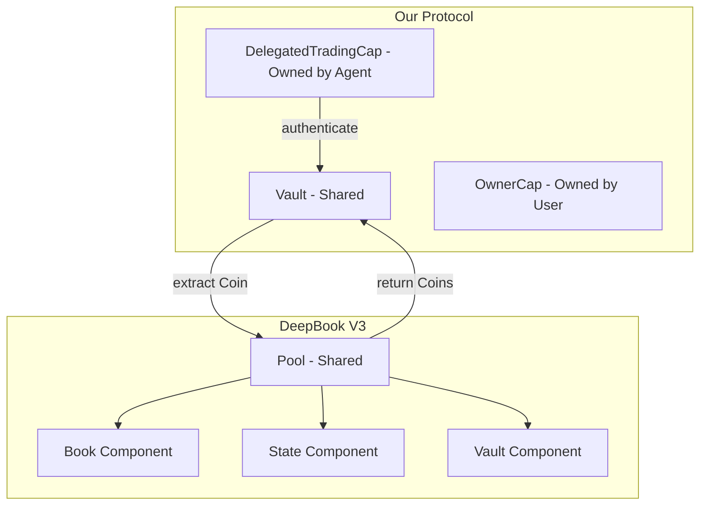
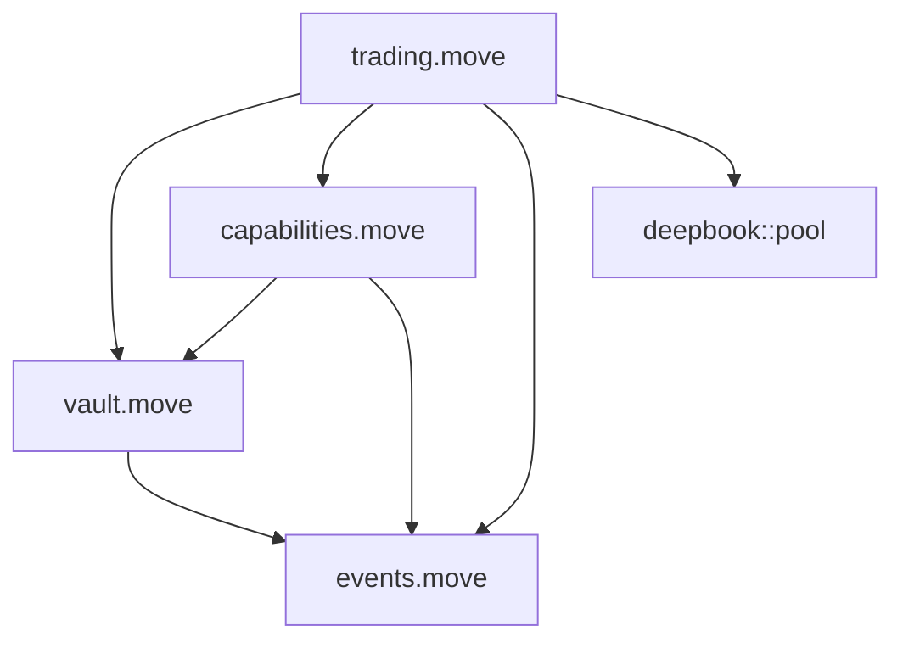

# Architecture & Capabilities Deep Dive

## Time-Locked Vault with Delegated AI Trading Capabilities

> This document is the **authoritative reference** for all struct definitions, object ownership models, capability lifecycle management, and how the Move type system enforces security invariants at compile time.

---

## Table of Contents

1. [Object Ownership Model](#1-object-ownership-model)
2. [Struct Definitions](#2-struct-definitions)
3. [Capability Lifecycle](#3-capability-lifecycle)
4. [Multi-Asset Vault via Dynamic Fields](#4-multi-asset-vault-via-dynamic-fields)
5. [Authentication Protocol](#5-authentication-protocol)
6. [Revocation Mechanism](#6-revocation-mechanism)
7. [DeepBook V3 Integration Architecture](#7-deepbook-v3-integration-architecture)
8. [Event Architecture](#8-event-architecture)
9. [Module Dependency Map](#9-module-dependency-map)

---

## 1. Object Ownership Model

Sui's object model defines three ownership categories. Our architecture deliberately uses two of them to optimize for both security and latency:

### 1.1 Owned Objects — Fast-Path Execution

Objects owned by a single address. Transactions using **only** owned objects bypass Mysticeti consensus entirely — they execute via **Byzantine Consistent Broadcast** with ~400ms finality.

**Our Owned Objects:**

| Object | Owner | Purpose |
|---|---|---|
| `OwnerCap` | Vault creator address | Absolute authority over the vault |
| `DelegatedTradingCap` | AI agent address | Bounded trading authorization |

### 1.2 Shared Objects — Mysticeti Consensus

Objects accessible by any transaction. Must be sequenced through the **Mysticeti DAG consensus** protocol to prevent state conflicts.

**Our Shared Objects:**

| Object | Why Shared | Consensus Cost |
|---|---|---|
| `Vault` | Both owner and agent need mutable access | Requires Mysticeti ordering |
| DeepBook `Pool<Base, Quote>` | Global order book — many participants | Requires Mysticeti ordering |

### 1.3 Hybrid Consensus Path

When a transaction involves both owned and shared objects, the validators first perform fast-path verification of the owned objects, then queue the transaction for Mysticeti consensus on the shared objects. This means:

```
Agent signs TX with DelegatedTradingCap (Owned)
    │
    ├──▶ Fast-Path: Verify agent owns the cap (~400ms)
    │
    └──▶ Mysticeti: Sequence Vault + Pool mutations (~600ms)
```

The owned object validation acts as a **pre-filter** — if the agent doesn't possess the cap, the transaction is rejected before entering the heavier consensus path.

---

## 2. Struct Definitions

### 2.1 Vault

```move
/// The core vault that holds user assets.
/// Instantiated as a Shared Object via transfer::share_object.
/// 
/// IMPORTANT: Does NOT have the `store` ability — it cannot be transferred
/// or wrapped inside another object. Once shared, it stays shared.
public struct Vault has key {
    id: UID,
    /// Monotonically increasing version counter.
    /// Incremented by the owner to universally revoke all DelegatedTradingCaps.
    /// DelegatedTradingCap.version must match this value for authentication.
    version: u64,
    /// Maximum allowed slippage in basis points (e.g., 100 = 1%).
    /// Agent-provided min_out values are validated against this ceiling.
    max_slippage_bps: u64,
    /// Emergency kill switch. When false, all trades are rejected
    /// regardless of cap validity.
    trading_enabled: bool,
    // ──────────────────────────────────────────────
    // Asset balances are stored as Dynamic Fields on self.id:
    //
    //   Key:   sui::type_name::TypeName  (unique per token type)
    //   Value: sui::balance::Balance<T>
    //
    // This approach allows the vault to hold any number of
    // different token types without generic parameters.
    // ──────────────────────────────────────────────
}
```

**Ability Analysis:**
- `key` — Required for all Sui objects. Gives it a unique `UID` and allows it to exist in global storage.
- No `store` — Deliberately omitted. The vault cannot be transferred, wrapped, or placed as a dynamic field of another object. Once shared, it is permanently shared.
- No `copy` — Implicit (structs with `key` can never have `copy`). The vault cannot be duplicated.
- No `drop` — Implicit. The vault cannot be silently discarded — it must be explicitly destroyed by a function that unpacks it, preventing accidental loss of funds.

### 2.2 OwnerCap

```move
/// Grants absolute authority over a specific Vault.
/// Minted once during vault creation and transferred to the creator.
///
/// Functions gated by OwnerCap:
///   - deposit<T>
///   - withdraw<T>
///   - mint_delegated_trading_cap
///   - revoke_all_delegations
///   - update_max_slippage
///   - set_trading_enabled
///   - emergency_withdraw_all<T>
public struct OwnerCap has key, store {
    id: UID,
    /// The ID of the Vault this cap controls.
    /// Validated in every owner function: assert!(cap.vault_id == object::id(vault))
    vault_id: ID,
}
```

**Ability Analysis:**
- `key` — It is a Sui object with a unique identity.
- `store` — Can be transferred between addresses via `transfer::public_transfer`. This enables: 
  - The owner to transfer vault ownership to a new address
  - Wrapping inside a multisig/timelock for institutional setups
- No `copy` — There is exactly one `OwnerCap` per vault. It cannot be duplicated.
- No `drop` — It cannot be silently discarded. Ownership is permanent unless explicitly transferred or destroyed.

### 2.3 DelegatedTradingCap

```move
/// Grants bounded trading authority over a specific Vault.
/// Minted by the vault owner and transferred to an AI agent address.
///
/// All constraints are embedded directly in the struct —
/// no additional storage lookups required at authentication time.
///
/// Functions accessible with DelegatedTradingCap:
///   - execute_swap_base_to_quote<BaseAsset, QuoteAsset>
///   - execute_swap_quote_to_base<BaseAsset, QuoteAsset>
public struct DelegatedTradingCap has key, store {
    id: UID,
    /// The ID of the Vault this cap can trade on behalf of.
    vault_id: ID,
    /// The Sui epoch after which this cap becomes invalid.
    /// Checked via: cap.expiration_epoch > tx_context::epoch(ctx)
    expiration_epoch: u64,
    /// Remaining cumulative trade volume allowed (in base asset units).
    /// Decremented by trade_amount on each successful trade.
    /// Trade rejected when remaining_trade_volume < requested amount.
    remaining_trade_volume: u64,
    /// Maximum volume for a single trade execution.
    /// Prevents a rogue agent from using entire quota in one swap.
    max_trade_size: u64,
    /// Snapshot of Vault.version at mint time.
    /// Must match vault.version at authentication — if the owner
    /// has incremented the vault version, this cap is revoked.
    version: u64,
}
```

**Ability Analysis:**
- `key` — It is a Sui object with a unique identity.
- `store` — Can be transferred. The owner mints it and transfers to the agent's address.
- **No `copy`** — This is the critical security property. The trading rights **cannot be duplicated**. If an agent's key is compromised, the attacker has at most one cap — they cannot clone it to create parallel trading agents.
- No `drop` — Cannot be silently discarded.

### 2.4 Ability Matrix

| Struct | `key` | `store` | `copy` | `drop` | Rationale |
|---|---|---|---|---|---|
| `Vault` | ✅ | ❌ | ❌ | ❌ | Shared immovable object; funds locked inside |
| `OwnerCap` | ✅ | ✅ | ❌ | ❌ | Transferable authority; unique per vault |
| `DelegatedTradingCap` | ✅ | ✅ | ❌ | ❌ | Transferable bounded authority; non-duplicable |
| `Balance<T>` | ❌ | ❌ | ❌ | ❌ | Raw value type; can only exist inside objects |
| `Coin<T>` | ✅ | ✅ | ❌ | ❌ | Transferable token object; ephemeral in our system |

The key insight: **`Balance<T>` has no abilities at all** — it cannot be stored independently, transferred, copied, or dropped. It can only exist as a field inside another struct. This is why we use it for vault internals — it physically cannot leave the vault without being explicitly extracted via `balance::split` into a `Coin<T>`.

---

## 3. Capability Lifecycle

### 3.1 State Machine

```mermaid
stateDiagram-v2
    [*] --> Minted: Owner calls mint_delegated_trading_cap
    Minted --> Active: transfer::public_transfer to agent
    Active --> Trading: Agent passes cap to authenticate_trade
    Trading --> Active: Trade succeeds - quota decremented
    Trading --> Exhausted: remaining_trade_volume hits 0
    Active --> Expired: Current epoch > expiration_epoch
    Active --> Revoked: Owner increments vault.version
    Exhausted --> Destroyed: Anyone can clean up inert cap
    Expired --> Destroyed: Anyone can clean up inert cap
    Revoked --> Destroyed: Anyone can clean up inert cap
    Destroyed --> [*]: Storage rebate returned
```

### 3.2 Minting

```move
/// Called by the vault owner to create a new DelegatedTradingCap.
/// The cap is transferred directly to the specified delegate address.
public fun mint_delegated_trading_cap(
    vault: &Vault,
    owner_cap: &OwnerCap,
    delegate: address,
    expiration_epoch: u64,
    trade_volume_limit: u64,
    max_trade_size: u64,
    ctx: &mut TxContext,
) {
    // Validate owner controls this vault
    assert!(owner_cap.vault_id == object::id(vault), EInvalidOwnerCap);
    // Expiration must be in the future
    assert!(expiration_epoch > tx_context::epoch(ctx), EInvalidExpiration);
    
    let cap = DelegatedTradingCap {
        id: object::new(ctx),
        vault_id: object::id(vault),
        expiration_epoch,
        remaining_trade_volume: trade_volume_limit,
        max_trade_size,
        version: vault.version,  // Snapshot current vault version
    };
    
    // Emit event for off-chain tracking
    event::emit(DelegationMinted {
        cap_id: object::id(&cap),
        vault_id: object::id(vault),
        delegate,
        expiration_epoch,
        trade_volume_limit,
        max_trade_size,
    });
    
    // Transfer to the delegate
    transfer::public_transfer(cap, delegate);
}
```

### 3.3 Usage (Trading)

Each time the agent trades, the cap is passed by **mutable reference** (`&mut DelegatedTradingCap`). This is critical:

- **Mutable reference** ensures exclusive access — no other transaction can use this cap simultaneously
- The `remaining_trade_volume` field is decremented in-place
- The cap object's version in storage is updated automatically when the transaction commits

### 3.4 Expiration Modes

| Mode | Trigger | Cost | Scope |
|---|---|---|---|
| **Epoch Expiry** | `current_epoch > cap.expiration_epoch` | Zero — automatic | Single cap |
| **Quota Exhaustion** | `cap.remaining_trade_volume == 0` | Zero — automatic | Single cap |
| **Version Revocation** | `cap.version != vault.version` | O(1) — owner increments counter | **All caps simultaneously** |
| **Emergency Shutdown** | `vault.trading_enabled == false` | O(1) — owner flips boolean | **All trading globally** |

### 3.5 Cleanup

Inert caps (expired, exhausted, or revoked) still occupy storage. We provide a cleanup function that anyone can call:

```move
/// Destroy an inert DelegatedTradingCap and recover its storage rebate.
/// Can be called by anyone — the cap is useless anyway.
public fun destroy_inert_cap(
    vault: &Vault,
    cap: DelegatedTradingCap,
    ctx: &TxContext,
) {
    let DelegatedTradingCap {
        id,
        vault_id: _,
        expiration_epoch,
        remaining_trade_volume,
        max_trade_size: _,
        version,
    } = cap;
    
    // Must be actually inert
    assert!(
        tx_context::epoch(ctx) >= expiration_epoch ||
        remaining_trade_volume == 0 ||
        version != vault.version,
        ECapStillActive,
    );
    
    object::delete(id);
    // Storage rebate is automatically returned to the transaction sender
}
```

---

## 4. Multi-Asset Vault via Dynamic Fields

### 4.1 Design Pattern

Rather than making `Vault` generic (`Vault<Base, Quote>`), which would require separate vault instances per trading pair, we use **Dynamic Fields** to store arbitrary `Balance<T>` values:

```
Vault (UID: 0xABC)
  │
  ├── Dynamic Field [TypeName("0x2::sui::SUI")]     → Balance<SUI>: 10_000_000_000
  ├── Dynamic Field [TypeName("0xUSDC::usdc::USDC")] → Balance<USDC>: 5_000_000
  └── Dynamic Field [TypeName("0xDEEP::deep::DEEP")] → Balance<DEEP>: 1_000_000_000
```

### 4.2 Implementation

```move
use sui::type_name::{Self, TypeName};
use sui::dynamic_field;
use sui::balance::{Self, Balance};
use sui::coin::{Self, Coin};

/// Deposit any fungible token into the vault.
/// Creates a new Dynamic Field if this is the first deposit of this asset type.
public fun deposit<T>(
    vault: &mut Vault,
    owner_cap: &OwnerCap,
    coin: Coin<T>,
    _ctx: &mut TxContext,
) {
    assert!(owner_cap.vault_id == object::id(vault), EInvalidCap);
    
    let key = type_name::get<T>();
    let amount = coin::value(&coin);
    
    if (dynamic_field::exists_(&vault.id, key)) {
        let balance_mut = dynamic_field::borrow_mut<TypeName, Balance<T>>(
            &mut vault.id, key
        );
        balance::join(balance_mut, coin::into_balance(coin));
    } else {
        dynamic_field::add(&mut vault.id, key, coin::into_balance(coin));
    };
    
    event::emit(BalanceChanged {
        vault_id: object::id(vault),
        asset_type: type_name::into_string(key).into_bytes(),
        amount,
        is_deposit: true,
    });
}

/// Withdraw a specific amount of any token from the vault.
public fun withdraw<T>(
    vault: &mut Vault,
    owner_cap: &OwnerCap,
    amount: u64,
    ctx: &mut TxContext,
): Coin<T> {
    assert!(owner_cap.vault_id == object::id(vault), EInvalidCap);
    
    let key = type_name::get<T>();
    let balance_mut = dynamic_field::borrow_mut<TypeName, Balance<T>>(
        &mut vault.id, key
    );
    
    event::emit(BalanceChanged {
        vault_id: object::id(vault),
        asset_type: type_name::into_string(key).into_bytes(),
        amount,
        is_deposit: false,
    });
    
    coin::take(balance_mut, amount, ctx)
}

/// Query the current balance of any token type.
public fun balance_of<T>(vault: &Vault): u64 {
    let key = type_name::get<T>();
    if (dynamic_field::exists_(&vault.id, key)) {
        balance::value(
            dynamic_field::borrow<TypeName, Balance<T>>(&vault.id, key)
        )
    } else {
        0
    }
}
```

### 4.3 Why Dynamic Fields over Alternatives

| Approach | Trade-off | Our Choice |
|---|---|---|
| Generic `Vault<T>` | Separate vault per asset; can't hold multi-asset | ❌ |
| `Bag` (heterogeneous collection) | Weaker type safety; harder to reason about | ❌ |
| `Table<TypeName, Balance<T>>` | Cannot store different `T` values in the same table | ❌ |
| **Dynamic Fields keyed by `TypeName`** | ✅ Type-safe, single vault, arbitrary assets | ✅ |

The `TypeName` key ensures that `dynamic_field::borrow_mut<TypeName, Balance<SUI>>` will never accidentally return a `Balance<USDC>` — the Move type system enforces this at compile time.

---

## 5. Authentication Protocol

### 5.1 The `authenticate_trade` Function

This is the security heart of the system. Every trade call invokes this function first:

```move
/// Validate the DelegatedTradingCap against the Vault state.
/// Decrements remaining_trade_volume on success.
/// Aborts with a specific error code on any violation.
fun authenticate_trade(
    vault: &Vault,
    cap: &mut DelegatedTradingCap,
    trade_amount: u64,
    clock: &Clock,
    ctx: &TxContext,
) {
    // ── CHECK 1: Vault ID match ──
    assert!(cap.vault_id == object::id(vault), EInvalidVault);
    
    // ── CHECK 2: Trading globally enabled ──
    assert!(vault.trading_enabled, ETradingDisabled);
    
    // ── CHECK 3: Version match (revocation check) ──
    assert!(cap.version == vault.version, ECapRevoked);
    
    // ── CHECK 4: Epoch expiration ──
    assert!(cap.expiration_epoch > tx_context::epoch(ctx), ECapExpired);
    
    // ── CHECK 5: Per-trade size limit ──
    assert!(trade_amount <= cap.max_trade_size, ETradeTooLarge);
    
    // ── CHECK 6: Cumulative quota remaining ──
    assert!(cap.remaining_trade_volume >= trade_amount, EQuotaExceeded);
    
    // ── DECREMENT quota ──
    cap.remaining_trade_volume = cap.remaining_trade_volume - trade_amount;
}
```

### 5.2 Assertion Ordering Rationale

The assertions are ordered from cheapest to most "informative" failure:

1. **Vault ID** — O(1) ID comparison; catches completely wrong inputs
2. **Trading enabled** — O(1) boolean; catches emergency shutdowns
3. **Version match** — O(1) integer comparison; catches revoked caps
4. **Epoch check** — O(1) integer comparison; catches expired caps
5. **Trade size** — O(1) integer comparison; catches oversized trades
6. **Quota remaining** — O(1) integer comparison; catches exhausted quotas

All checks are constant-time with no storage reads beyond the objects already in scope.

### 5.3 Slippage Protection

The vault enforces a maximum slippage tolerance that the agent cannot exceed:

```move
/// Validate that the agent's slippage tolerance doesn't exceed the vault's maximum.
/// Called before executing the DeepBook swap.
fun validate_slippage(
    vault: &Vault,
    expected_out: u64,
    min_out: u64,
) {
    // Calculate implied slippage in basis points
    // slippage_bps = ((expected_out - min_out) * 10000) / expected_out
    let slippage_bps = ((expected_out - min_out) * 10000) / expected_out;
    assert!(slippage_bps <= vault.max_slippage_bps, ESlippageExceeded);
}
```

---

## 6. Revocation Mechanism

### 6.1 Version Counter Pattern

```move
/// Revoke ALL outstanding DelegatedTradingCaps in O(1).
/// Simply increments the vault's version counter.
/// All caps with a stale version will fail the version check in authenticate_trade.
public fun revoke_all_delegations(
    vault: &mut Vault,
    owner_cap: &OwnerCap,
    _ctx: &TxContext,
) {
    assert!(owner_cap.vault_id == object::id(vault), EInvalidCap);
    
    vault.version = vault.version + 1;
    
    event::emit(AllDelegationsRevoked {
        vault_id: object::id(vault),
        new_version: vault.version,
    });
}
```

### 6.2 Why This Works

```
Timeline:
  
  Epoch 1: Owner creates vault (version = 0)
  Epoch 1: Owner mints cap_A (cap_A.version = 0) → Agent A
  Epoch 2: Owner mints cap_B (cap_B.version = 0) → Agent B
  Epoch 3: Owner calls revoke_all_delegations → vault.version = 1
  
  Epoch 3: Agent A attempts trade:
    authenticate_trade checks: cap_A.version (0) == vault.version (1)? → FALSE
    → Abort with ECapRevoked ✓
  
  Epoch 3: Agent B attempts trade:
    authenticate_trade checks: cap_B.version (0) == vault.version (1)? → FALSE
    → Abort with ECapRevoked ✓
  
  Epoch 3: Owner mints cap_C (cap_C.version = 1) → Agent C
  Epoch 3: Agent C attempts trade:
    authenticate_trade checks: cap_C.version (1) == vault.version (1)? → TRUE
    → Proceed ✓
```

### 6.3 Comparison: Individual vs. Universal Revocation

| Method | Gas Cost | Requires Tracking? | Atomicity |
|---|---|---|---|
| Destroy individual cap | O(1) per cap, but need object ID | Yes — must store all cap IDs | One at a time |
| **Version counter increment** | **O(1) total** | **No tracking needed** | **All caps at once** |

---

## 7. DeepBook V3 Integration Architecture

### 7.1 Object Interaction Map



### 7.2 Full Trade Function

```move
/// Execute a base-to-quote swap using delegated authority.
/// This is the primary function called by the AI agent's PTB.
public fun execute_swap_base_to_quote<BaseAsset, QuoteAsset>(
    vault: &mut Vault,
    cap: &mut DelegatedTradingCap,
    pool: &mut Pool<BaseAsset, QuoteAsset>,
    trade_amount: u64,
    min_quote_out: u64,
    clock: &Clock,
    ctx: &mut TxContext,
) {
    // ── PHASE 1: Authentication ──
    authenticate_trade(vault, cap, trade_amount, clock, ctx);
    
    // ── PHASE 2: Extract coins from vault ──
    let base_coin = extract_coin<BaseAsset>(vault, trade_amount, ctx);
    let deep_coin = extract_coin<DEEP>(vault, estimate_deep_fee(), ctx);
    
    // ── PHASE 3: Execute DeepBook swap ──
    let (base_leftover, quote_received, deep_leftover) =
        pool::swap_exact_base_for_quote(
            pool,
            base_coin,
            deep_coin,
            min_quote_out,
            clock,
            ctx,
        );
    
    let quote_amount = coin::value(&quote_received);
    
    // ── PHASE 4: Deposit results back into vault ──
    deposit_coin<BaseAsset>(vault, base_leftover);
    deposit_coin<QuoteAsset>(vault, quote_received);
    deposit_coin<DEEP>(vault, deep_leftover);
    
    // ── PHASE 5: Emit trade event ──
    event::emit(TradeExecuted {
        vault_id: object::id(vault),
        cap_id: object::id(cap),
        is_base_to_quote: true,
        amount_in: trade_amount,
        amount_out: quote_amount,
        remaining_volume: cap.remaining_trade_volume,
        epoch: tx_context::epoch(ctx),
    });
}

/// Mirror function for quote-to-base swaps.
public fun execute_swap_quote_to_base<BaseAsset, QuoteAsset>(
    vault: &mut Vault,
    cap: &mut DelegatedTradingCap,
    pool: &mut Pool<BaseAsset, QuoteAsset>,
    trade_amount: u64,
    min_base_out: u64,
    clock: &Clock,
    ctx: &mut TxContext,
) {
    // Same pattern: authenticate → extract → swap → deposit → emit
    // Uses pool::swap_exact_quote_for_base instead
}
```

### 7.3 Internal Helper Functions

```move
/// Extract a Coin<T> from the vault's dynamic field Balance<T>.
fun extract_coin<T>(
    vault: &mut Vault,
    amount: u64,
    ctx: &mut TxContext,
): Coin<T> {
    let key = type_name::get<T>();
    assert!(dynamic_field::exists_(&vault.id, key), EInsufficientBalance);
    
    let balance_mut = dynamic_field::borrow_mut<TypeName, Balance<T>>(
        &mut vault.id, key
    );
    assert!(balance::value(balance_mut) >= amount, EInsufficientBalance);
    
    coin::take(balance_mut, amount, ctx)
}

/// Deposit a Coin<T> back into the vault's dynamic field Balance<T>.
fun deposit_coin<T>(
    vault: &mut Vault,
    coin: Coin<T>,
) {
    if (coin::value(&coin) == 0) {
        coin::destroy_zero(coin);
        return
    };
    
    let key = type_name::get<T>();
    if (dynamic_field::exists_(&vault.id, key)) {
        let balance_mut = dynamic_field::borrow_mut<TypeName, Balance<T>>(
            &mut vault.id, key
        );
        balance::join(balance_mut, coin::into_balance(coin));
    } else {
        dynamic_field::add(&mut vault.id, key, coin::into_balance(coin));
    };
}
```

---

## 8. Event Architecture

### 8.1 Event Struct Definitions

All events have `copy + drop` abilities — they exist only during transaction execution and are emitted to the event stream for off-chain indexing.

```move
module time_locked_vault::events;

use sui::object::ID;

/// Emitted when a new vault is created
public struct VaultCreated has copy, drop {
    vault_id: ID,
    owner: address,
    max_slippage_bps: u64,
}

/// Emitted when a DelegatedTradingCap is minted
public struct DelegationMinted has copy, drop {
    cap_id: ID,
    vault_id: ID,
    delegate: address,
    expiration_epoch: u64,
    trade_volume_limit: u64,
    max_trade_size: u64,
}

/// Emitted when a trade is executed by an AI agent
public struct TradeExecuted has copy, drop {
    vault_id: ID,
    cap_id: ID,
    is_base_to_quote: bool,
    amount_in: u64,
    amount_out: u64,
    remaining_volume: u64,
    epoch: u64,
}

/// Emitted when all delegations are revoked via version bump
public struct AllDelegationsRevoked has copy, drop {
    vault_id: ID,
    new_version: u64,
}

/// Emitted on any deposit or withdrawal
public struct BalanceChanged has copy, drop {
    vault_id: ID,
    asset_type: vector<u8>,
    amount: u64,
    is_deposit: bool,
}

/// Emitted when trading is enabled or disabled
public struct TradingStatusChanged has copy, drop {
    vault_id: ID,
    enabled: bool,
}
```

### 8.2 Off-Chain Event Consumption

```typescript
// Subscribe to vault events
const events = await client.queryEvents({
    query: {
        MoveEventType: `${PACKAGE_ID}::events::TradeExecuted`,
    },
    order: 'descending',
    limit: 50,
});

// Parse trade history
for (const event of events.data) {
    const trade = event.parsedJson as {
        vault_id: string;
        cap_id: string;
        is_base_to_quote: boolean;
        amount_in: string;
        amount_out: string;
        remaining_volume: string;
        epoch: string;
    };
    console.log(`Trade: ${trade.amount_in} → ${trade.amount_out}`);
}
```

---

## 9. Module Dependency Map

### 9.1 Internal Module Graph



### 9.2 Function Visibility Matrix

| Function | Module | Visibility | Callable By |
|---|---|---|---|
| `create_vault_and_share` | vault | `public` | Anyone (creates vault + returns OwnerCap) |
| `deposit<T>` | vault | `public` | OwnerCap holder |
| `withdraw<T>` | vault | `public` | OwnerCap holder |
| `balance_of<T>` | vault | `public` | Anyone (read-only) |
| `mint_delegated_trading_cap` | capabilities | `public` | OwnerCap holder |
| `destroy_inert_cap` | capabilities | `public` | Anyone (cleanup) |
| `execute_swap_base_to_quote` | trading | `public` | DelegatedTradingCap holder |
| `execute_swap_quote_to_base` | trading | `public` | DelegatedTradingCap holder |
| `authenticate_trade` | trading | `fun` (private) | Internal only |
| `extract_coin<T>` | trading | `fun` (private) | Internal only |
| `deposit_coin<T>` | trading | `fun` (private) | Internal only |
| `revoke_all_delegations` | vault | `public` | OwnerCap holder |
| `set_trading_enabled` | vault | `public` | OwnerCap holder |

### 9.3 Initialization Flow

```move
/// Module initializer — called once when the package is published.
/// Creates the first vault and transfers OwnerCap to the publisher.
fun init(ctx: &mut TxContext) {
    // Option A: Auto-create a default vault
    // Option B: Provide a public create function (preferred for flexibility)
    // We go with Option B — no init logic needed.
}

/// Public vault creation function.
/// Anyone can create a vault; they receive the OwnerCap.
public fun create_vault_and_share(
    max_slippage_bps: u64,
    ctx: &mut TxContext,
) {
    let vault = Vault {
        id: object::new(ctx),
        version: 0,
        max_slippage_bps,
        trading_enabled: true,
    };
    
    let owner_cap = OwnerCap {
        id: object::new(ctx),
        vault_id: object::id(&vault),
    };
    
    event::emit(VaultCreated {
        vault_id: object::id(&vault),
        owner: tx_context::sender(ctx),
        max_slippage_bps,
    });
    
    transfer::share_object(vault);
    transfer::transfer(owner_cap, tx_context::sender(ctx));
}
```

---

*This document serves as the definitive architectural reference for the Time-Locked Vault system. All implementation must conform to the struct definitions, ability assignments, and security protocols defined herein.*
