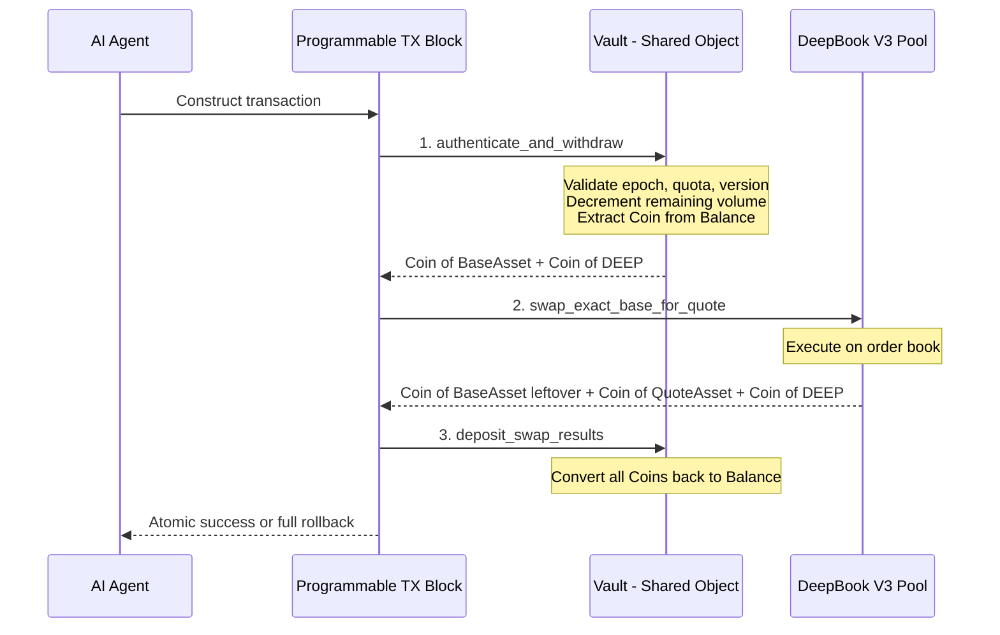

# ⏳ Time-Locked Vault with Delegated AI Trading Capabilities

> A non-custodial DeFi vault on **Sui** that grants time-bound, quota-limited trading capabilities to an AI agent — without surrendering custody of the underlying assets. Built to showcase the power of Sui Move's **Capability Pattern**, **Programmable Transaction Blocks**, and **DeepBook V3** integration.

[](https://sui.io)
[](https://deepbook.tech)
[](LICENSE)

---

## 🎯 What This Project Demonstrates

| Sui Paradigm | Implementation |
|---|---|
| **Capability Pattern** | `OwnerCap` (absolute authority) and `DelegatedTradingCap` (bounded agent access) as first-class objects with embedded state |
| **Object-Centric Data Model** | Vault as Shared Object, Capabilities as Owned Objects — hybrid consensus paths |
| **Programmable Transaction Blocks** | 3-step atomic trade pipeline: authenticate → swap on DeepBook → deposit results |
| **Balance\<T\> over Coin\<T\>** | Internal vault accounting uses `Balance<T>` to prevent accidental transfers from shared state |
| **Dynamic Fields** | Multi-asset vault holding arbitrary token types via `TypeName`-keyed dynamic fields |
| **Move Registry (MVR)** | Human-readable package routing in TypeScript PTB construction |
| **Negative Testing** | Security proofs via `#[expected_failure]` — demonstrating compile-time guarantees |

---

## 🏗️ Architecture Overview

### System Components

```
┌─────────────────────────────────────────────────────────────────┐
│                        SUI NETWORK                              │
│                                                                 │
│  ┌─────────────┐     ┌──────────────────────────────────────┐  │
│  │  OwnerCap   │     │         Vault - Shared Object         │  │
│  │  - Owned    │────▶│  ┌─────────────────────────────────┐ │  │
│  │  - Fast Path│     │  │  Dynamic Fields                  │ │  │
│  └─────────────┘     │  │  ├─ Balance<SUI>                 │ │  │
│                       │  │  ├─ Balance<USDC>                │ │  │
│  ┌─────────────┐     │  │  └─ Balance<DEEP>                │ │  │
│  │  Delegated  │     │  ├─────────────────────────────────┤ │  │
│  │  TradingCap │────▶│  │  version: u64                    │ │  │
│  │  - Owned    │     │  │  max_slippage_bps: u64           │ │  │
│  │  - Fast Path│     │  │  trading_enabled: bool           │ │  │
│  └─────────────┘     │  └─────────────────────────────────┘ │  │
│        │              └──────────────────────────────────────┘  │
│        │                              │                         │
│        │              ┌───────────────▼──────────────────┐      │
│        └─────────────▶│    DeepBook V3 Pool              │      │
│                       │    - Shared Object               │      │
│                       │    - Mysticeti Consensus          │      │
│                       └──────────────────────────────────┘      │
└─────────────────────────────────────────────────────────────────┘
```

### PTB Trade Flow

The AI agent constructs a single Programmable Transaction Block that atomically executes:



### Consensus Path Analysis

| Object | Type | Path | Latency |
|---|---|---|---|
| `OwnerCap` | Owned | Fast-Path (Byzantine Consistent Broadcast) | ~400ms |
| `DelegatedTradingCap` | Owned | Fast-Path | ~400ms |
| `Vault` | Shared | Mysticeti DAG Consensus | ~600ms |
| `DeepBook Pool` | Shared | Mysticeti DAG Consensus | ~600ms |

---

## 📁 Project Structure

```
time_locked_vault/
├── Move.toml                          # Package manifest
├── sources/
│   ├── vault.move                     # Core vault: create, deposit, withdraw, Dynamic Fields
│   ├── capabilities.move              # OwnerCap & DelegatedTradingCap lifecycle
│   ├── trading.move                   # Trade authentication, DeepBook integration
│   └── events.move                    # Event structs for off-chain indexing
├── tests/
│   ├── vault_tests.move               # Vault creation, deposit, withdrawal
│   ├── capability_tests.move          # Cap minting, expiry, quota, version
│   ├── trading_tests.move             # Trade flow simulation
│   └── negative_tests.move            # Security proofs via expected_failure
├── scripts/
│   ├── deploy.ts                      # Testnet deployment script
│   ├── execute_trade.ts               # AI agent trade execution
│   └── manage_vault.ts                # Owner management operations
├── plans/
│   ├── PHASE_1_HIGH_LEVEL_DESIGN.md
│   └── PHASE_2_TECH_STACK_AND_ARCHITECTURE.md
├── README.md                          # This file
├── ARCHITECTURE_AND_CAPABILITIES.md   # Deep dive into struct definitions & ownership
├── SUI_MOVE_BEST_PRACTICES.md         # Style guide and coding standards
└── SUI_VS_SOLANA_PLAYBOOK.md          # Interview cheat sheet
```

---

## 🚀 Quick Start

### Prerequisites

```bash
# Verify Sui CLI
sui --version   # Requires >= 1.45

# Verify active environment
sui client active-env   # Should show 'testnet'

# Verify active address has testnet SUI
sui client gas
```

### Build & Test

```bash
# Build the package
sui move build

# Run all tests (includes negative security proofs)
sui move test --verbose

# Run specific test suites
sui move test --filter negative_tests
sui move test --filter capability_tests

# Generate test coverage report
sui move test --coverage
```

### Deploy to Testnet

```bash
# Dry-run first
sui client publish --gas-budget 100000000 --dry-run

# Publish
sui client publish --gas-budget 100000000

# Capture the output:
# → Package ID: 0x<PACKAGE_ID>
# → OwnerCap: 0x<OWNER_CAP_ID>
# → Vault: 0x<VAULT_ID>
```

### TypeScript Client Setup

```bash
cd scripts/
npm install
npx tsx deploy.ts        # Deploy and initialize vault
npx tsx manage_vault.ts  # Deposit funds, mint delegation caps
npx tsx execute_trade.ts # Execute a delegated swap via PTB
```

---

## 🔒 Security Model

### Capability-Based Access Control

```
Owner (absolute authority)              AI Agent (bounded authority)
       │                                        │
       ▼                                        ▼
   OwnerCap                            DelegatedTradingCap
   ├── vault_id                        ├── vault_id
   └── abilities: key, store           ├── expiration_epoch: u64
       (no copy!)                      ├── remaining_trade_volume: u64
                                       ├── max_trade_size: u64
                                       ├── version: u64
                                       └── abilities: key, store
                                           (no copy!)
```

### Three-Assertion Authentication

Every trade by the AI agent must pass:
1. **Epoch check:** `cap.expiration_epoch > current_epoch` — Is the cap still valid?
2. **Quota check:** `cap.remaining_trade_volume >= trade_amount` — Is there sufficient quota?
3. **Version check:** `cap.version == vault.version` — Has the owner revoked delegations?

### O(1) Universal Revocation

The owner calls `revoke_all_delegations` which increments `vault.version`. All outstanding `DelegatedTradingCap` objects become instantly invalid — no iteration, no gas scaling, no need to locate caps.

---

## 🧪 Testing Strategy

| Tier | Method | Purpose |
|---|---|---|
| **Tier 1** | `#[test]` unit tests | Pure logic verification |
| **Tier 2** | `test_scenario` multi-tx tests | Multi-address, multi-epoch simulation |
| **Tier 3** | `#[expected_failure]` negative tests | **Security proofs** — unauthorized actions MUST abort |

### Key Negative Tests (Security Proofs)

| Test | Error Code | Proves |
|---|---|---|
| Expired cap attempted | `ECapExpired` | Time-bound enforcement works |
| Volume quota exceeded | `EQuotaExceeded` | Cumulative limits enforced |
| Revoked cap (version mismatch) | `ECapRevoked` | O(1) revocation works |
| Wrong vault targeted | `EInvalidVault` | Cross-vault protection |
| Single trade too large | `ETradeTooLarge` | Per-trade ceiling enforced |
| Trading disabled by owner | `ETradingDisabled` | Emergency shutdown works |

---

## 🔑 Key Architectural Decisions

| Decision | Rationale |
|---|---|
| `Balance<T>` over `Coin<T>` for vault storage | Prevents accidental transfers from shared state; `Balance` has no `key`/`store` abilities |
| Dynamic Fields for multi-asset | Single vault object holds arbitrary token types without generic parameters |
| BalanceManager-free DeepBook swaps | Simpler object graph; our vault is its own fund management layer |
| Version counter for revocation | O(1) universal invalidation vs. O(n) cap iteration |
| Separate `events.move` module | Clean separation of concerns; easy to extend event schema |
| MVR plugin for client-side | Human-readable package routing demonstrates ecosystem awareness |

---

## 📚 Documentation

| Document | Description |
|---|---|
| [`ARCHITECTURE_AND_CAPABILITIES.md`](ARCHITECTURE_AND_CAPABILITIES.md) | Deep dive into struct definitions, object ownership, capability lifecycle |
| [`SUI_MOVE_BEST_PRACTICES.md`](SUI_MOVE_BEST_PRACTICES.md) | Style guide, coding standards, anti-patterns to avoid |
| [`SUI_VS_SOLANA_PLAYBOOK.md`](SUI_VS_SOLANA_PLAYBOOK.md) | Interview cheat sheet mapping Solana patterns to Sui equivalents |

---

## 📄 License

MIT

---

*Built as a proof-of-concept for demonstrating mastery of Sui Move's object-centric DeFi architecture.*
