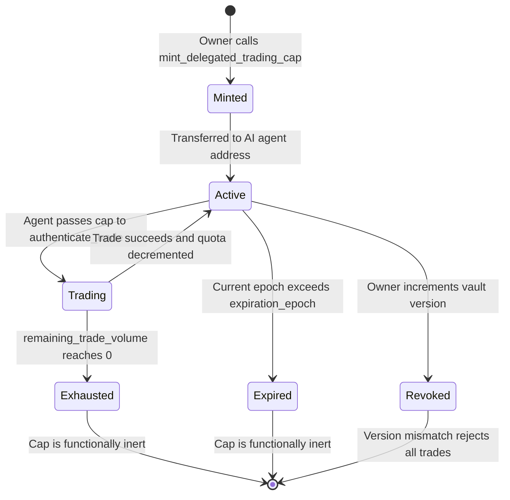
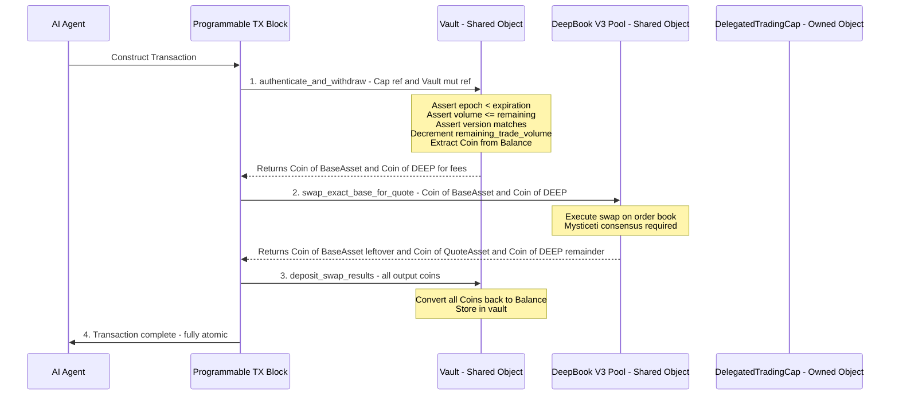

# Phase 1: High-Level Design & Feature Specification

## Time-Locked Vault with Delegated AI Trading Capabilities

---

## 1. Core Concept: The Non-Custodial Shared Object Vault

The system is a **non-custodial asset management vault** where a user deposits capital and delegates bounded trading authority to an automated AI agent — without ever surrendering custody of the underlying assets.

### The Vault as a Shared Object

The `Vault` is instantiated as a **Shared Object** on Sui. This is a deliberate architectural choice:

- **Shared Objects** are accessible by any transaction but require sequencing through the **Mysticeti DAG consensus** protocol to prevent state conflicts. This is necessary because the vault holds pooled capital that multiple actors (the owner and the AI agent) may need to interact with concurrently.
- The vault stores user capital as `Balance<T>` — **not** `Coin<T>`. This is a critical security decision. `Balance<T>` is a raw fungible value without the `key` or `store` abilities, meaning it **cannot be transferred out of the vault as a standalone object**. It can only be manipulated by functions within our module that hold a mutable reference to the vault. This eliminates an entire class of accidental transfer bugs that plague naive implementations.
- To execute a trade, a `Coin<T>` is extracted from the internal `Balance<T>` at the precise moment of execution, passed into the DeepBook V3 swap function, and the resulting output coins are immediately deposited back as `Balance<T>`. The `Coin<T>` exists ephemerally — only within the PTB execution context.

### Why Non-Custodial?

The AI agent **never holds tokens**. It holds a *capability object* that authorizes it to instruct the vault to execute trades within strict parameters. The vault itself performs the asset movements. If the agent's key is compromised, the attacker can only execute trades within the remaining quota and epoch window — they cannot drain the vault outright. The owner can revoke the capability at any time.

---

## 2. Access Control: The Capability Architecture

This is the centerpiece of the design and directly implements the patterns Manos Liolios advocated at Sui Basecamp 2024: **no hardcoded admin addresses, capabilities as first-class objects with embedded state**.

### 2.1 `OwnerCap` — Absolute Authority

```
┌──────────────────────────────┐
│          OwnerCap            │
│  ────────────────────────    │
│  id: UID                     │
│  vault_id: ID                │
│  ────────────────────────    │
│  Abilities: key, store       │
│  Ownership: Owned Object     │
│  Consensus: Fast-Path        │
└──────────────────────────────┘
```

**Properties:**
- **Owned Object** assigned directly to the vault creator's address
- Transactions using only the `OwnerCap` bypass Mysticeti consensus — they execute via **Byzantine Consistent Broadcast** on the fast-path with sub-second finality
- Grants unrestricted authority: deposit, withdraw, mint delegation capabilities, revoke delegation capabilities, and emergency shutdown
- Linked to a specific `Vault` via the embedded `vault_id` field — one cap per vault
- Has `key` + `store` abilities: can exist in global storage and be transferred. Critically lacks `copy` — it cannot be duplicated

**Owner Functions:**
| Function | Description |
|---|---|
| `deposit<T>` | Add funds to the vault's `Balance<T>` |
| `withdraw<T>` | Extract funds from the vault's `Balance<T>` to a `Coin<T>` sent to owner |
| `mint_delegated_trading_cap` | Create a new time-bound, quota-limited trading capability |
| `revoke_delegated_trading_cap` | Invalidate a specific delegation by incrementing the vault's version counter |
| `emergency_withdraw_all<T>` | Drain all balances and freeze trading |

### 2.2 `DelegatedTradingCap` — Bounded Agent Authorization

```
┌──────────────────────────────────────────┐
│         DelegatedTradingCap              │
│  ──────────────────────────────────────  │
│  id: UID                                 │
│  vault_id: ID                            │
│  expiration_epoch: u64                   │
│  remaining_trade_volume: u64             │
│  max_trade_size: u64                     │
│  version: u64                            │
│  ──────────────────────────────────────  │
│  Abilities: key, store                   │
│  Ownership: Owned Object                 │
│  Consensus: Fast-Path for validation     │
│             Mysticeti for vault mutation  │
└──────────────────────────────────────────┘
```

**Properties:**
- **Owned Object** transferred to the AI agent's address
- Has `key` + `store` abilities: can be held by the agent and transferred. Explicitly **lacks `copy`** — trading rights cannot be duplicated by a compromised backend
- Embeds all authorization constraints directly inside the struct:
  - `expiration_epoch` — the Sui epoch after which this cap becomes invalid
  - `remaining_trade_volume` — maximum cumulative volume remaining, decremented on each trade
  - `max_trade_size` — per-trade ceiling to prevent a single massive swap
  - `version` — must match the vault's internal version counter; if the owner bumps the vault version, all previously issued caps become instantly invalid without needing to locate and destroy them

**Embedded State Enforcement:**
The constraints live *inside* the capability struct — no additional storage lookups are required at trade time. The `authenticate_trade` function performs three constant-time assertions:

1. `cap.expiration_epoch > ctx.epoch()` — Is the cap still valid in this epoch?
2. `cap.remaining_trade_volume >= requested_amount` — Does the agent have sufficient quota?
3. `cap.version == vault.version` — Has the owner revoked all delegations?

If all pass, the cap's `remaining_trade_volume` is decremented and execution proceeds.

### 2.3 Capability Lifecycle



### 2.4 Revocation Strategy: Version-Gated Invalidation

Rather than requiring the owner to locate and destroy each `DelegatedTradingCap` individually — which would require tracking every cap's object ID — we use a **version counter** pattern:

- The `Vault` struct contains a `version: u64` field
- Each `DelegatedTradingCap` captures the vault's version at mint time
- The `authenticate_trade` function asserts `cap.version == vault.version`
- The owner calls `revoke_all_delegations(&OwnerCap, &mut Vault)` which simply increments `vault.version`
- **All** outstanding caps are instantly invalidated in O(1) — no iteration, no gas scaling with cap count

This is a pattern Manos specifically advocates: using on-chain version registries to invalidate capabilities universally.

---

## 3. Execution Flow: The PTB Trade Pipeline

The AI agent constructs a single **Programmable Transaction Block** that atomically performs the full trade lifecycle. This is where Sui's client-side orchestration shines — complex multi-step DeFi operations without intermediate smart contracts holding funds mid-flight.

### 3.1 PTB Command Sequence



### 3.2 Step-by-Step Breakdown

**Step 1: `authenticate_and_withdraw<BaseAsset, QuoteAsset>`**
- Inputs: `&DelegatedTradingCap`, `&mut Vault`, `trade_amount: u64`, `&Clock`, `&TxContext`
- Validates all three capability assertions (epoch, quota, version)
- Decrements `cap.remaining_trade_volume` by `trade_amount`
- Calls `balance::split(&mut vault.base_balance, trade_amount)` to extract a `Coin<BaseAsset>`
- Also extracts a `Coin<DEEP>` from the vault's DEEP balance for DeepBook fees
- Returns: `(Coin<BaseAsset>, Coin<DEEP>)`

**Step 2: DeepBook V3 `swap_exact_base_for_quote`**
- Inputs: `&mut Pool<BaseAsset, QuoteAsset>`, `Coin<BaseAsset>`, `Coin<DEEP>`, `min_quote_out: u64`, `&Clock`, `&TxContext`
- Executes the swap against the DeepBook V3 order book
- Uses the **BalanceManager-free swap interface** — no need for pre-registration
- Returns: `(Coin<BaseAsset>, Coin<QuoteAsset>, Coin<DEEP>)` — leftover base, received quote, remaining DEEP fees

**Step 3: `deposit_swap_results<BaseAsset, QuoteAsset>`**
- Inputs: `&mut Vault`, `Coin<BaseAsset>`, `Coin<QuoteAsset>`, `Coin<DEEP>`
- Converts each coin back to balance and merges into the vault's internal stores
- All value is accounted for — nothing leaks out of the vault

### 3.3 Consensus Path Analysis

This is a key talking point for the interview:

| Object | Type | Consensus Path | Why |
|---|---|---|---|
| `DelegatedTradingCap` | Owned | **Fast-Path** via Byzantine Consistent Broadcast | Single owner; no contention possible |
| `Vault` | Shared | **Mysticeti DAG** consensus | Multiple actors may access concurrently |
| `Pool<Base, Quote>` | Shared | **Mysticeti DAG** consensus | Global order book with many participants |

Because the `DelegatedTradingCap` is an Owned Object, validators can quickly verify the agent's ownership on the fast-path *before* the transaction enters the heavier Mysticeti sequencing required for the Shared Objects. This hybrid model minimizes latency where possible.

### 3.4 DeepBook V3 Integration: BalanceManager-Free Swaps

We specifically target DeepBook V3's **direct swap interface** (`swap_exact_base_for_quote` / `swap_exact_quote_for_base`) rather than the `BalanceManager`-based order flow. The rationale:

- **No BalanceManager registration required** — our vault acts as its own fund management layer
- **Simpler object graph** — we pass `Coin` objects directly rather than managing a separate `BalanceManager` shared object
- **Atomic within a single PTB** — extract coin from vault balance, swap, deposit results, all in one block
- **Better composability** — any protocol can call our vault's trade function without needing to understand DeepBook's `BalanceManager` semantics

The DeepBook V3 direct swap function signature we target:

```move
public fun swap_exact_base_for_quote<BaseAsset, QuoteAsset>(
    pool: &mut Pool<BaseAsset, QuoteAsset>,
    base_in: Coin<BaseAsset>,
    deep_fee: Coin<DEEP>,
    min_quote_out: u64,
    clock: &Clock,
    ctx: &mut TxContext,
): (Coin<BaseAsset>, Coin<QuoteAsset>, Coin<DEEP>)
```

This returns three values: leftover base asset, received quote asset, and remaining DEEP tokens — all of which our vault captures and re-deposits.

---

## 4. Solana Contrast: Why Object-Centric Wins

As a 5-year Solana veteran, this section maps the mental model shift from Solana's account-based architecture to Sui's object-centric paradigm. This is structured as interview ammunition.

### 4.1 Delegation: PDA Seeds vs. Capability Objects

**Solana Approach:**
To build this same system on Solana, you would:
1. Derive a PDA from `[b"vault", user_pubkey]` to act as the vault's signing authority
2. Create a separate **data account** (another PDA or keypair account) to store delegation rules: `expiry_slot`, `remaining_volume`, `delegate_pubkey`
3. The delegate's program must execute a CPI into the vault program, which then:
   - Deserializes the delegation data account
   - Validates the delegate's signature against the stored pubkey
   - Checks slot-based expiry via `Clock` sysvar
   - Executes a CPI into a DEX program, providing the vault PDA as signer via `invoke_signed`
4. Revocation requires locating the delegation data account, zeroing its data, and reclaiming rent

**Sui Approach:**
1. Mint a `DelegatedTradingCap` struct with constraints embedded inside
2. `transfer::public_transfer(cap, agent_address)` — done
3. The agent passes the cap by reference; the vault module validates by reading struct fields
4. Revocation: increment a version counter — all caps invalidated instantly

| Metric | Solana | Sui |
|---|---|---|
| **Identity Model** | Cryptographic seed derivation + pubkey matching | Definitive ownership of a distinct object |
| **Constraint Storage** | Separate data account linked to PDA via seeds | Fields embedded directly in the capability struct |
| **Delegation Transfer** | Rewrite account data and update authority fields | `transfer::public_transfer` — one function call |
| **Revocation** | Locate account, zero data, reclaim rent-exempt SOL | Increment version counter — O(1) universal invalidation |
| **CPI Overhead** | Nested `invoke_signed` chains with account pre-declaration | Direct function call within PTB — no CPI stack |

### 4.2 Transaction Composition: Instruction Array vs. PTB

**Solana:**
- Transactions contain a flat array of instructions, each specifying a program ID and a set of accounts
- **All accounts must be declared upfront** in the transaction's account list — you cannot dynamically discover accounts mid-execution
- Complex flows require CPI chains where each program yields execution context to the next, creating deeply nested call stacks
- Compute Unit limits (200K default, 1.4M max) fragment complex operations across multiple transactions with intermediate state accounts

**Sui:**
- PTBs contain up to **1,024 sequential commands** that share a unified execution context
- The **output of one command becomes the input of the next** — results flow through the PTB like a pipeline
- No CPI is needed; the client constructs the full execution graph declaratively
- A single gas budget covers the entire block — no fragmentation

### 4.3 Reentrancy: Runtime Guards vs. Type System Guarantees

**Solana:**
- Reentrancy is a constant threat via CPI callbacks
- Programs must implement explicit `is_locked` boolean flags or use Anchor's `#[account(constraint = !vault.locked)]` pattern
- These are **runtime checks** that add gas overhead and can be accidentally omitted

**Sui Move:**
- Reentrancy is **structurally impossible** in the Move execution model
- The borrow checker ensures mutable references are exclusive — you cannot re-enter a function while it holds a `&mut` reference to an object
- The Move Bytecode Verifier enforces this at **compile time**, not runtime
- Zero gas overhead, zero human error surface

### 4.4 Rent Exemption vs. Storage Rebates

**Solana:**
- Every account requires rent-exempt minimum balance (~0.00089 SOL for a typical account)
- Closing accounts requires explicit lamport recovery logic
- Delegation data accounts accumulate rent obligations

**Sui:**
- Objects pay a one-time storage deposit at creation
- When objects are deleted, the **storage rebate is returned** to the transaction sender
- Capability objects that expire can be cleaned up, recovering their storage deposit
- No ongoing rent liability

---

## 5. Feature Summary Matrix

| Feature | Implementation | Sui Primitive |
|---|---|---|
| Non-custodial vault | Shared Object holding `Balance<T>` | `sui::balance`, `transfer::share_object` |
| Owner authority | `OwnerCap` as Owned Object | Capability pattern, fast-path execution |
| Delegated trading | `DelegatedTradingCap` with embedded constraints | Capability with quota + epoch + version |
| Time-bound access | Epoch-based expiration | `sui::clock::Clock`, `tx_context::epoch` |
| Volume quotas | Per-trade and cumulative limits | Struct field mutation on capability |
| Universal revocation | Version counter on vault | O(1) invalidation pattern |
| DEX integration | DeepBook V3 direct swaps | `pool::swap_exact_base_for_quote` |
| Atomic execution | Single PTB with piped commands | Programmable Transaction Blocks |
| Type-safe assets | `Balance<T>` internal, `Coin<T>` ephemeral | Move type system, no runtime checks |

---

## 6. Open Design Questions for Discussion

Before proceeding to Phase 2, I want to flag these design decisions for your input:

1. **Multi-asset vault vs. single-asset vault:** Should the vault support multiple `Balance<T>` types simultaneously (e.g., SUI, USDC, DEEP) via Dynamic Fields, or should we keep it simple with typed generics `Vault<BaseAsset, QuoteAsset>`?

2. **Swap direction flexibility:** Should the `DelegatedTradingCap` encode the allowed swap direction (base→quote only, quote→base only, or bidirectional)?

3. **Slippage protection:** Should `min_quote_out` be hardcoded in the cap, computed by the AI agent per-trade, or passed as a parameter with a vault-level maximum slippage tolerance?

4. **Event emission:** Should we emit rich Sui Events for every trade, cap mint, and revocation to support off-chain indexing and the AI agent's trade history?

5. **DEEP token fee handling:** Should the vault maintain a dedicated DEEP balance for swap fees, or should the agent supply DEEP tokens separately?

---

> **PHASE 1 COMPLETE — AWAITING YOUR REVIEW**
>
> Please review this high-level design and provide:
> - Approval to proceed to Phase 2
> - Any modifications to the capability structure
> - Your preferences on the open design questions above
> - Any additional features or constraints you want included
