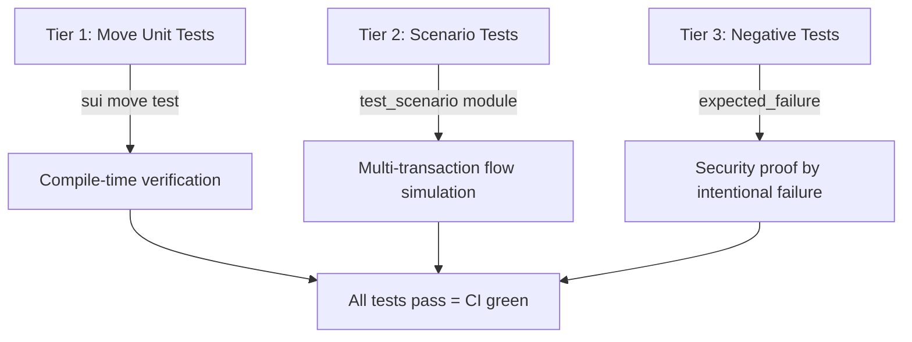
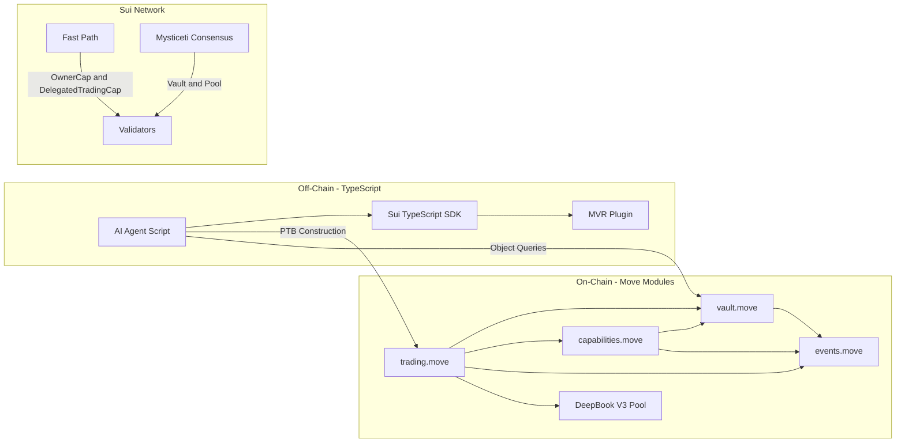

# Phase 2: Tech Stack Requirements & Architecture Mapping

## Time-Locked Vault with Delegated AI Trading Capabilities

> **Approved Design Decisions from Phase 1:**
> - Multi-asset vault via Dynamic Fields
> - Bidirectional swaps (base→quote and quote→base)
> - Agent-computed slippage with vault-level maximum tolerance
> - Rich Sui Event emission for off-chain indexing
> - Vault-managed DEEP balance for swap fees

---

## 1. Smart Contract Layer: Sui Move Framework

### 1.1 Package Structure

```
time_locked_vault/
├── Move.toml
├── sources/
│   ├── vault.move              # Core vault logic, Balance management, Dynamic Fields
│   ├── capabilities.move       # OwnerCap, DelegatedTradingCap definitions and lifecycle
│   ├── trading.move            # authenticate_and_withdraw, deposit_swap_results, DeepBook interaction
│   └── events.move             # Event struct definitions for off-chain indexing
├── tests/
│   ├── vault_tests.move        # Vault creation, deposit, withdrawal tests
│   ├── capability_tests.move   # Cap minting, expiry, quota, version tests
│   ├── trading_tests.move      # Trade flow simulation tests
│   └── negative_tests.move     # Authorization failure tests (the "proof" tests)
```

### 1.2 Move.toml Configuration

```toml
[package]
name = "time_locked_vault"
edition = "2024.beta"

# Since Sui >= 1.45, Sui, Bridge, MoveStdlib, and SuiSystem are imported implicitly
[dependencies]
DeepBookV3 = { git = "https://github.com/MystenLabs/deepbookv3.git", subdir = "packages/deepbook", rev = "main" }

[addresses]
time_locked_vault = "0x0"
deepbook = "0xdee9"
```

**Key Notes:**
- `edition = "2024.beta"` enables modern Move features (public struct syntax, method syntax, positional fields)
- Sui framework dependencies (`sui::balance`, `sui::object`, `sui::transfer`, etc.) are **implicitly imported** as of Sui 1.45 — no explicit dependency declaration needed
- DeepBook V3 is imported directly from the MystenLabs repository
- The `0x0` address for our package gets replaced with the actual package ID upon publication

### 1.3 Core Framework Modules to Import

Each source file will import from these Sui framework modules:

#### [`vault.move`](sources/vault.move)

```move
module time_locked_vault::vault;

// Object model
use sui::object::{Self, UID, ID};
use sui::transfer;
use sui::tx_context::TxContext;

// Asset management
use sui::balance::{Self, Balance};
use sui::coin::{Self, Coin};

// Multi-asset support
use sui::dynamic_field;

// Time
use sui::clock::Clock;

// Events
use sui::event;
```

#### [`capabilities.move`](sources/capabilities.move)

```move
module time_locked_vault::capabilities;

use sui::object::{Self, UID, ID};
use sui::transfer;
use sui::tx_context::{Self, TxContext};
use sui::clock::Clock;
use sui::event;

// Cross-module references
use time_locked_vault::vault::Vault;
use time_locked_vault::events;
```

#### [`trading.move`](sources/trading.move)

```move
module time_locked_vault::trading;

use sui::balance::{Self, Balance};
use sui::coin::{Self, Coin};
use sui::clock::Clock;
use sui::tx_context::TxContext;
use sui::event;

// DeepBook V3
use deepbook::pool::{Self, Pool};
use token::deep::DEEP;

// Internal modules
use time_locked_vault::vault::{Self, Vault};
use time_locked_vault::capabilities::DelegatedTradingCap;
use time_locked_vault::events;
```

### 1.4 Struct Definitions with Precise Abilities

```move
// ═══════════════════════════════════════════════════════
// VAULT — Shared Object
// ═══════════════════════════════════════════════════════
public struct Vault has key {
    id: UID,
    /// Version counter for O(1) universal revocation of all DelegatedTradingCaps
    version: u64,
    /// Maximum slippage tolerance in basis points (e.g., 100 = 1%)
    max_slippage_bps: u64,
    /// Whether trading is currently enabled
    trading_enabled: bool,
    // ──────────────────────────────────────────────────
    // Asset balances stored as Dynamic Fields:
    //   dynamic_field::add<TypeName, Balance<T>>(&mut self.id, type_name::get<T>(), balance)
    // This allows the vault to hold Balance<SUI>, Balance<USDC>, Balance<DEEP>, etc.
    // without requiring generic type parameters on the Vault struct itself.
    // ──────────────────────────────────────────────────
}

// ═══════════════════════════════════════════════════════
// OWNER CAPABILITY — Owned Object (Fast-Path)
// ═══════════════════════════════════════════════════════
public struct OwnerCap has key, store {
    id: UID,
    /// Links this capability to a specific vault
    vault_id: ID,
}

// ═══════════════════════════════════════════════════════
// DELEGATED TRADING CAPABILITY — Owned Object (Fast-Path)
// ═══════════════════════════════════════════════════════
public struct DelegatedTradingCap has key, store {
    id: UID,
    /// Links this capability to a specific vault
    vault_id: ID,
    /// Epoch after which this capability is invalid
    expiration_epoch: u64,
    /// Remaining cumulative trade volume allowed
    remaining_trade_volume: u64,
    /// Maximum single trade size allowed
    max_trade_size: u64,
    /// Must match vault.version — if mismatch, cap is revoked
    version: u64,
}

// ═══════════════════════════════════════════════════════
// TYPE KEY — For Dynamic Field indexing
// ═══════════════════════════════════════════════════════
// We use sui::type_name::TypeName as the key for dynamic fields.
// This gives us a unique, type-safe key for each Balance<T>.
```

### 1.5 Multi-Asset Vault via Dynamic Fields

Rather than making `Vault` generic (which would require separate vault instances per asset pair), we use **Dynamic Fields** keyed by `TypeName`:

```move
use sui::type_name::{Self, TypeName};

/// Deposit any fungible token type into the vault
public fun deposit<T>(
    vault: &mut Vault,
    owner_cap: &OwnerCap,
    coin: Coin<T>,
    _ctx: &mut TxContext,
) {
    assert!(owner_cap.vault_id == object::id(vault), EInvalidCap);
    let key = type_name::get<T>();

    if (dynamic_field::exists_(&vault.id, key)) {
        // Merge into existing balance
        let balance_mut = dynamic_field::borrow_mut<TypeName, Balance<T>>(&mut vault.id, key);
        balance::join(balance_mut, coin::into_balance(coin));
    } else {
        // First deposit of this asset type
        dynamic_field::add(&mut vault.id, key, coin::into_balance(coin));
    };
}

/// Get the current balance of any token type
public fun balance_of<T>(vault: &Vault): u64 {
    let key = type_name::get<T>();
    if (dynamic_field::exists_(&vault.id, key)) {
        balance::value(dynamic_field::borrow<TypeName, Balance<T>>(&vault.id, key))
    } else {
        0
    }
}
```

**Why Dynamic Fields over Generics:**
- A single `Vault` object can hold SUI, USDC, DEEP, and any future token type
- No need to create separate vault instances per trading pair
- The `TypeName` key provides compile-time type safety — you cannot accidentally access a `Balance<SUI>` as `Balance<USDC>`
- The vault's object ID remains stable regardless of how many asset types it holds

### 1.6 Event Definitions

```move
module time_locked_vault::events;

use sui::object::ID;

// ═══════════════════════════════════════════════════════
// EVENTS — For off-chain indexing and AI agent trade history
// ═══════════════════════════════════════════════════════

/// Emitted when a new vault is created
public struct VaultCreated has copy, drop {
    vault_id: ID,
    owner: address,
    max_slippage_bps: u64,
}

/// Emitted when a DelegatedTradingCap is minted
public struct DelegationMinted has copy, drop {
    cap_id: ID,
    vault_id: ID,
    delegate: address,
    expiration_epoch: u64,
    trade_volume_limit: u64,
    max_trade_size: u64,
}

/// Emitted when a trade is executed by the AI agent
public struct TradeExecuted has copy, drop {
    vault_id: ID,
    cap_id: ID,
    /// true = base→quote, false = quote→base
    is_base_to_quote: bool,
    amount_in: u64,
    amount_out: u64,
    remaining_volume: u64,
    epoch: u64,
}

/// Emitted when all delegations are revoked
public struct AllDelegationsRevoked has copy, drop {
    vault_id: ID,
    new_version: u64,
}

/// Emitted on any deposit or withdrawal
public struct BalanceChanged has copy, drop {
    vault_id: ID,
    /// TypeName string of the asset
    asset_type: vector<u8>,
    /// Positive for deposits, amount for withdrawals
    amount: u64,
    is_deposit: bool,
}
```

---

## 2. DeFi Integration: DeepBook V3

### 2.1 Target Function Signatures

We target DeepBook V3's **BalanceManager-free swap interface**. These are the exact function signatures from the DeepBook V3 package:

#### Base → Quote Swap
```move
/// From deepbook::pool
public fun swap_exact_base_for_quote<BaseAsset, QuoteAsset>(
    pool: &mut Pool<BaseAsset, QuoteAsset>,
    base_in: Coin<BaseAsset>,
    deep_fee: Coin<DEEP>,
    min_quote_out: u64,
    clock: &Clock,
    ctx: &mut TxContext,
): (Coin<BaseAsset>, Coin<QuoteAsset>, Coin<DEEP>)
```

**Returns:**
- `Coin<BaseAsset>` — Any leftover base tokens not filled
- `Coin<QuoteAsset>` — The received quote tokens
- `Coin<DEEP>` — Remaining DEEP tokens after fee deduction

#### Quote → Base Swap
```move
/// From deepbook::pool
public fun swap_exact_quote_for_base<BaseAsset, QuoteAsset>(
    pool: &mut Pool<BaseAsset, QuoteAsset>,
    quote_in: Coin<QuoteAsset>,
    deep_fee: Coin<DEEP>,
    min_base_out: u64,
    clock: &Clock,
    ctx: &mut TxContext,
): (Coin<BaseAsset>, Coin<QuoteAsset>, Coin<DEEP>)
```

**Returns:**
- `Coin<BaseAsset>` — The received base tokens
- `Coin<QuoteAsset>` — Any leftover quote tokens not filled
- `Coin<DEEP>` — Remaining DEEP tokens after fee deduction

### 2.2 Our Wrapper Functions

We wrap these DeepBook calls with our authentication and vault management logic:

```move
/// Execute a base-to-quote swap using delegated authority
public fun execute_swap_base_to_quote<BaseAsset, QuoteAsset>(
    vault: &mut Vault,
    cap: &mut DelegatedTradingCap,
    pool: &mut Pool<BaseAsset, QuoteAsset>,
    trade_amount: u64,
    min_quote_out: u64,
    clock: &Clock,
    ctx: &mut TxContext,
) {
    // 1. Authenticate and enforce constraints
    authenticate_trade(vault, cap, trade_amount, clock, ctx);
    
    // 2. Enforce vault-level slippage tolerance
    // (Agent provides min_quote_out, but vault can enforce a floor)

    // 3. Extract coins from vault balances (Dynamic Fields)
    let base_coin = extract_coin<BaseAsset>(vault, trade_amount, ctx);
    let deep_coin = extract_coin<DEEP>(vault, estimate_deep_fee(trade_amount), ctx);

    // 4. Execute DeepBook swap
    let (base_leftover, quote_received, deep_leftover) = pool::swap_exact_base_for_quote(
        pool, base_coin, deep_coin, min_quote_out, clock, ctx
    );

    // 5. Deposit all results back into vault
    deposit_coin<BaseAsset>(vault, base_leftover);
    deposit_coin<QuoteAsset>(vault, quote_received);
    deposit_coin<DEEP>(vault, deep_leftover);

    // 6. Emit trade event
    event::emit(TradeExecuted {
        vault_id: object::id(vault),
        cap_id: object::id(cap),
        is_base_to_quote: true,
        amount_in: trade_amount,
        amount_out: coin::value(&quote_received),
        remaining_volume: cap.remaining_trade_volume,
        epoch: tx_context::epoch(ctx),
    });
}
```

### 2.3 DeepBook V3 Pool Architecture Reference

Understanding what we're interacting with:

```
┌─────────────────────────────────────────────────┐
│           DeepBook V3 Pool - Shared Object       │
│  ─────────────────────────────────────────────── │
│  ┌──────────┐  ┌──────────┐  ┌───────────────┐  │
│  │   Book   │  │  State   │  │    Vault      │  │
│  │──────────│  │──────────│  │───────────────│  │
│  │ Order    │  │ User     │  │ Settlement    │  │
│  │ matching │  │ volumes  │  │ of base and   │  │
│  │ engine   │  │ history  │  │ quote tokens  │  │
│  │          │  │ govnance │  │               │  │
│  └──────────┘  └──────────┘  └───────────────┘  │
└─────────────────────────────────────────────────┘
```

- **Book:** Core order book logic, matching engine
- **State:** Individual user accounting, historical volumes, governance parameters
- **Vault:** Settlement layer, finalizes movement of base and quote tokens

We interact exclusively via the direct swap functions — no BalanceManager registration required.

### 2.4 Testnet Pool Configuration

For testnet deployment and testing, we need to know:

| Parameter | Value |
|---|---|
| Network | Sui Testnet |
| DeepBook Package | Published on testnet (resolve via MVR) |
| Target Pools | SUI/USDC, or available testnet pairs |
| DEEP Token | Required for swap fees |

We will use the **MVR plugin** to resolve package addresses dynamically rather than hardcoding them.

---

## 3. Client-Side Orchestration: TypeScript SDK

### 3.1 Dependencies

```json
{
  "dependencies": {
    "@mysten/sui": "^1.x",
    "@mysten/mvr-static": "^1.x",
    "@mysten/deepbook-v3": "^1.x",
    "typescript": "^5.x"
  },
  "devDependencies": {
    "tsx": "^4.x",
    "@types/node": "^20.x"
  }
}
```

### 3.2 MVR Plugin Integration

The Move Registry plugin replaces hardcoded 64-character hex package addresses with human-readable names, demonstrating best-practice usage of Sui's ecosystem tooling.

```typescript
import { Transaction } from '@mysten/sui/transactions';
import { SuiClient } from '@mysten/sui/client';
import { namedPackagesPlugin } from '@mysten/mvr-static';

// ═══════════════════════════════════════════════════════
// MVR GLOBAL REGISTRATION
// ═══════════════════════════════════════════════════════
// Register the MVR plugin globally so ALL Transaction instances
// automatically resolve human-readable package names to on-chain addresses.
Transaction.registerGlobalPlugin(
    namedPackagesPlugin({ suiClient })
);

// Now we can use human-readable names in moveCall targets:
const tx = new Transaction();

// Instead of:
//   tx.moveCall({ target: '0xdee9::pool::swap_exact_base_for_quote', ... })
// We write:
tx.moveCall({
    target: '@mysten/deepbook-v3::pool::swap_exact_base_for_quote',
    // MVR resolves this to the actual on-chain address at build time
    typeArguments: [baseAssetType, quoteAssetType],
    arguments: [pool, baseCoin, deepCoin, tx.pure.u64(minQuoteOut), clock],
});
```

### 3.3 Full PTB Construction Example

```typescript
import { Transaction, TransactionResult } from '@mysten/sui/transactions';
import { SuiClient, getFullnodeUrl } from '@mysten/sui/client';
import { Ed25519Keypair } from '@mysten/sui/keypairs/ed25519';
import { namedPackagesPlugin } from '@mysten/mvr-static';

// ═══════════════════════════════════════════════════════
// CONFIGURATION
// ═══════════════════════════════════════════════════════
const VAULT_PKG = '@your-org/time-locked-vault';  // or raw hex during development
const VAULT_OBJECT_ID = '0x...';  // Shared Object
const CAP_OBJECT_ID = '0x...';    // DelegatedTradingCap owned by agent
const POOL_OBJECT_ID = '0x...';   // DeepBook V3 Pool
const CLOCK_OBJECT_ID = '0x6';    // Sui system clock (always 0x6)

const client = new SuiClient({ url: getFullnodeUrl('testnet') });
const agentKeypair = Ed25519Keypair.fromSecretKey(/* agent's key */);

// Register MVR plugin
Transaction.registerGlobalPlugin(namedPackagesPlugin({ suiClient: client }));

// ═══════════════════════════════════════════════════════
// PTB CONSTRUCTION: Execute a delegated swap
// ═══════════════════════════════════════════════════════
async function executeDelegatedSwap(
    tradeAmount: bigint,
    minQuoteOut: bigint,
) {
    const tx = new Transaction();

    // Step 1: Authenticate and withdraw from vault
    //   Returns: [Coin<BaseAsset>, Coin<DEEP>]
    const [baseCoin, deepCoin] = tx.moveCall({
        target: `${VAULT_PKG}::trading::authenticate_and_withdraw`,
        typeArguments: ['0x2::sui::SUI', '0xusdc_type::usdc::USDC'],
        arguments: [
            tx.object(VAULT_OBJECT_ID),           // &mut Vault (Shared)
            tx.object(CAP_OBJECT_ID),              // &mut DelegatedTradingCap (Owned)
            tx.pure.u64(tradeAmount),              // trade_amount
            tx.object(CLOCK_OBJECT_ID),            // &Clock
        ],
    });

    // Step 2: Execute DeepBook V3 swap (base → quote)
    //   Returns: [Coin<BaseAsset>, Coin<QuoteAsset>, Coin<DEEP>]
    const [baseLeftover, quoteReceived, deepLeftover] = tx.moveCall({
        target: '@mysten/deepbook-v3::pool::swap_exact_base_for_quote',
        typeArguments: ['0x2::sui::SUI', '0xusdc_type::usdc::USDC'],
        arguments: [
            tx.object(POOL_OBJECT_ID),             // &mut Pool<Base, Quote> (Shared)
            baseCoin,                               // Coin<BaseAsset> from step 1
            deepCoin,                               // Coin<DEEP> from step 1
            tx.pure.u64(minQuoteOut),              // min_quote_out (slippage protection)
            tx.object(CLOCK_OBJECT_ID),            // &Clock
        ],
    });

    // Step 3: Deposit all results back into the vault
    tx.moveCall({
        target: `${VAULT_PKG}::trading::deposit_swap_results`,
        typeArguments: ['0x2::sui::SUI', '0xusdc_type::usdc::USDC'],
        arguments: [
            tx.object(VAULT_OBJECT_ID),            // &mut Vault
            baseLeftover,                           // Coin<BaseAsset> leftover
            quoteReceived,                          // Coin<QuoteAsset> received
            deepLeftover,                           // Coin<DEEP> remainder
        ],
    });

    // ═══════════════════════════════════════════════════
    // DRY RUN FIRST — validate before spending gas
    // ═══════════════════════════════════════════════════
    const dryRunResult = await client.dryRunTransactionBlock({
        transactionBlock: await tx.build({ client }),
    });
    console.log('Dry run status:', dryRunResult.effects.status);
    console.log('Estimated gas:', dryRunResult.effects.gasUsed);

    // Execute if dry run succeeds
    if (dryRunResult.effects.status.status === 'success') {
        const result = await client.signAndExecuteTransaction({
            signer: agentKeypair,
            transaction: tx,
            options: {
                showEffects: true,
                showEvents: true,
            },
        });
        
        console.log('Trade executed:', result.digest);
        console.log('Events:', result.events);
        return result;
    }

    throw new Error(`Dry run failed: ${dryRunResult.effects.status.error}`);
}
```

### 3.4 Key TypeScript SDK Patterns

| Pattern | Implementation | Purpose |
|---|---|---|
| MVR Plugin | `Transaction.registerGlobalPlugin(namedPackagesPlugin(...))` | Human-readable package routing |
| Shared Object Input | `tx.object(VAULT_ID)` with `mutable: true` annotation | References vault for mutation |
| Owned Object Input | `tx.object(CAP_ID)` | References agent's capability |
| Pure Value | `tx.pure.u64(amount)` | Passes scalar arguments |
| Result Piping | Destructure `moveCall` return into variables | Chain PTB commands |
| Dry Run | `client.dryRunTransactionBlock(...)` | Pre-validate and estimate gas |
| Clock Reference | `tx.object('0x6')` | System time for epoch checks |

---

## 4. Testing Framework

### 4.1 Testing Strategy Overview

We employ a **three-tier testing approach** directly aligned with Mysten Labs practices:



### 4.2 Tier 1: Move Unit Tests (`#[test]`)

Standard unit tests for pure logic functions:

```move
#[test_only]
module time_locked_vault::vault_tests;

use time_locked_vault::vault;
use time_locked_vault::capabilities;

#[test]
fun test_create_vault() {
    let mut ctx = tx_context::dummy();
    let (vault, owner_cap) = vault::create_vault(100, &mut ctx); // 100 bps = 1% max slippage
    
    assert!(vault::version(&vault) == 0);
    assert!(vault::max_slippage_bps(&vault) == 100);
    assert!(vault::trading_enabled(&vault) == true);
    
    // Cleanup
    test_utils::destroy(vault);
    test_utils::destroy(owner_cap);
}

#[test]
fun test_deposit_and_balance() {
    let mut ctx = tx_context::dummy();
    let (mut vault, owner_cap) = vault::create_vault(100, &mut ctx);
    
    let coin = coin::mint_for_testing<SUI>(1_000_000_000, &mut ctx); // 1 SUI
    vault::deposit(&mut vault, &owner_cap, coin, &mut ctx);
    
    assert!(vault::balance_of<SUI>(&vault) == 1_000_000_000);
    
    test_utils::destroy(vault);
    test_utils::destroy(owner_cap);
}
```

### 4.3 Tier 2: Scenario Tests (`sui::test_scenario`)

Multi-transaction, multi-address simulation — this is what Mysten Labs calls "deterministic simulation testing" at the Move level:

```move
#[test_only]
module time_locked_vault::capability_tests;

use sui::test_scenario;
use sui::clock;
use time_locked_vault::vault;
use time_locked_vault::capabilities;

const OWNER: address = @0xA;
const AGENT: address = @0xB;

#[test]
fun test_full_delegation_lifecycle() {
    let mut scenario = test_scenario::begin(OWNER);
    
    // ─── TX 1: Owner creates vault ───
    {
        let ctx = test_scenario::ctx(&mut scenario);
        vault::create_vault_and_share(100, ctx);
    };
    
    // ─── TX 2: Owner deposits funds ───
    test_scenario::next_tx(&mut scenario, OWNER);
    {
        let mut vault = test_scenario::take_shared<Vault>(&scenario);
        let owner_cap = test_scenario::take_from_sender<OwnerCap>(&scenario);
        let ctx = test_scenario::ctx(&mut scenario);
        
        let coin = coin::mint_for_testing<SUI>(10_000_000_000, ctx); // 10 SUI
        vault::deposit(&mut vault, &owner_cap, coin, ctx);
        
        assert!(vault::balance_of<SUI>(&vault) == 10_000_000_000);
        
        test_scenario::return_shared(vault);
        test_scenario::return_to_sender(&scenario, owner_cap);
    };
    
    // ─── TX 3: Owner mints DelegatedTradingCap for agent ───
    test_scenario::next_tx(&mut scenario, OWNER);
    {
        let vault = test_scenario::take_shared<Vault>(&scenario);
        let owner_cap = test_scenario::take_from_sender<OwnerCap>(&scenario);
        let ctx = test_scenario::ctx(&mut scenario);
        
        capabilities::mint_delegated_trading_cap(
            &vault,
            &owner_cap,
            AGENT,                     // delegate address
            10,                        // expires in epoch 10
            5_000_000_000,             // 5 SUI total volume limit
            1_000_000_000,             // 1 SUI max per trade
            ctx,
        );
        
        test_scenario::return_shared(vault);
        test_scenario::return_to_sender(&scenario, owner_cap);
    };
    
    // ─── TX 4: Agent uses DelegatedTradingCap ───
    test_scenario::next_tx(&mut scenario, AGENT);
    {
        let mut vault = test_scenario::take_shared<Vault>(&scenario);
        let mut cap = test_scenario::take_from_sender<DelegatedTradingCap>(&scenario);
        let clock = clock::create_for_testing(test_scenario::ctx(&mut scenario));
        let ctx = test_scenario::ctx(&mut scenario);
        
        // Verify cap constraints
        assert!(capabilities::remaining_volume(&cap) == 5_000_000_000);
        
        // Simulate authentication (without actual DeepBook call)
        // authenticate_trade would validate and decrement
        
        test_scenario::return_shared(vault);
        test_scenario::return_to_sender(&scenario, cap);
        clock::destroy_for_testing(clock);
    };
    
    test_scenario::end(scenario);
}
```

### 4.4 Tier 3: Negative Tests — The Security Proofs

These are the **most important tests for security validation**. Each one intentionally attempts an unauthorized action and proves the system correctly rejects it.

```move
#[test_only]
module time_locked_vault::negative_tests;

use sui::test_scenario;
use sui::clock;
use time_locked_vault::vault;
use time_locked_vault::capabilities;
use time_locked_vault::trading;

const OWNER: address = @0xA;
const AGENT: address = @0xB;
const ATTACKER: address = @0xC;

// ═══════════════════════════════════════════════════════
// TEST 1: Expired capability is rejected
// ═══════════════════════════════════════════════════════
#[test]
#[expected_failure(abort_code = trading::ECapExpired)]
fun test_expired_cap_rejected() {
    let mut scenario = test_scenario::begin(OWNER);
    // ... setup vault, deposit, mint cap with expiration_epoch = 5 ...
    
    // Advance to epoch 6 (past expiration)
    test_scenario::next_epoch(&mut scenario, OWNER);
    test_scenario::next_epoch(&mut scenario, OWNER);
    test_scenario::next_epoch(&mut scenario, OWNER);
    test_scenario::next_epoch(&mut scenario, OWNER);
    test_scenario::next_epoch(&mut scenario, OWNER);
    test_scenario::next_epoch(&mut scenario, OWNER);
    
    // Agent attempts trade — MUST abort with ECapExpired
    test_scenario::next_tx(&mut scenario, AGENT);
    {
        let mut vault = test_scenario::take_shared<Vault>(&scenario);
        let mut cap = test_scenario::take_from_sender<DelegatedTradingCap>(&scenario);
        let clock = clock::create_for_testing(test_scenario::ctx(&mut scenario));
        let ctx = test_scenario::ctx(&mut scenario);
        
        // This MUST abort — cap is expired
        trading::authenticate_trade(&mut vault, &mut cap, 1_000, &clock, ctx);
        
        // If execution reaches here, the test framework treats it as a failure
        // because we declared #[expected_failure]
        
        test_scenario::return_shared(vault);
        test_scenario::return_to_sender(&scenario, cap);
        clock::destroy_for_testing(clock);
    };
    
    test_scenario::end(scenario);
}

// ═══════════════════════════════════════════════════════
// TEST 2: Exceeded trade volume quota is rejected
// ═══════════════════════════════════════════════════════
#[test]
#[expected_failure(abort_code = trading::EQuotaExceeded)]
fun test_quota_exceeded_rejected() {
    // ... setup with remaining_trade_volume = 1_000 ...
    // ... attempt trade of 2_000 ...
    // MUST abort with EQuotaExceeded
}

// ═══════════════════════════════════════════════════════
// TEST 3: Version mismatch (revoked delegation) is rejected
// ═══════════════════════════════════════════════════════
#[test]
#[expected_failure(abort_code = trading::ECapRevoked)]
fun test_revoked_cap_rejected() {
    // ... setup vault, mint cap ...
    // Owner calls revoke_all_delegations (increments vault.version)
    // Agent attempts trade with stale version on cap
    // MUST abort with ECapRevoked
}

// ═══════════════════════════════════════════════════════
// TEST 4: Wrong vault ID on capability is rejected
// ═══════════════════════════════════════════════════════
#[test]
#[expected_failure(abort_code = trading::EInvalidVault)]
fun test_wrong_vault_rejected() {
    // ... create two vaults ...
    // ... mint cap linked to vault A ...
    // ... attempt trade on vault B ...
    // MUST abort with EInvalidVault
}

// ═══════════════════════════════════════════════════════
// TEST 5: Trade size exceeds per-trade max
// ═══════════════════════════════════════════════════════
#[test]
#[expected_failure(abort_code = trading::ETradeTooLarge)]
fun test_trade_too_large_rejected() {
    // ... setup with max_trade_size = 1_000 ...
    // ... attempt trade of 5_000 ...
    // MUST abort with ETradeTooLarge
}

// ═══════════════════════════════════════════════════════
// TEST 6: Trading disabled by owner
// ═══════════════════════════════════════════════════════
#[test]
#[expected_failure(abort_code = trading::ETradingDisabled)]
fun test_trading_disabled_rejected() {
    // ... owner calls emergency_disable_trading ...
    // ... agent attempts trade ...
    // MUST abort with ETradingDisabled
}
```

### 4.5 Error Constants

All error codes must be defined as named constants — no magic numbers:

```move
// In trading.move
const ECapExpired: u64 = 0;
const EQuotaExceeded: u64 = 1;
const ECapRevoked: u64 = 2;
const EInvalidVault: u64 = 3;
const ETradeTooLarge: u64 = 4;
const ETradingDisabled: u64 = 5;
const EInsufficientBalance: u64 = 6;
const ESlippageExceeded: u64 = 7;

// In vault.move
const EInvalidCap: u64 = 0;
const ENotOwner: u64 = 1;

// In capabilities.move
const EInvalidOwnerCap: u64 = 0;
const EInvalidExpiration: u64 = 1;
```

### 4.6 Test Execution Commands

```bash
# Run all tests
sui move test

# Run tests with verbose output (shows gas usage, test names)
sui move test --verbose

# Run a specific test module
sui move test --filter vault_tests

# Run only negative tests
sui move test --filter negative_tests

# Run tests with coverage report
sui move test --coverage

# Build without running tests (verify compilation)
sui move build
```

---

## 5. Architecture Boundary Map

### 5.1 Module Dependency Graph



### 5.2 Data Flow Boundaries

| Boundary | From | To | Data | Mechanism |
|---|---|---|---|---|
| Agent → Network | TypeScript | Sui Validators | Signed PTB | `signAndExecuteTransaction` |
| PTB → Vault | Transaction Context | `vault.move` | Mutable reference | Shared Object access via Mysticeti |
| PTB → Cap | Transaction Context | `capabilities.move` | Mutable reference | Owned Object access via Fast-Path |
| Vault → DeepBook | `trading.move` | `deepbook::pool` | `Coin<T>` objects | Direct function call within PTB |
| DeepBook → Vault | `deepbook::pool` | `trading.move` | Return tuple of Coins | PTB result piping |
| Events → Indexer | `event::emit` | Off-chain | Serialized event structs | Sui event subscription |

### 5.3 Security Boundaries

```
┌─────────────────────────────────────────────────────────┐
│                    TRUST BOUNDARY                       │
│                                                         │
│  Owner Address ─────── holds ────── OwnerCap            │
│       │                               │                 │
│       │ mints                         │ authorizes      │
│       ▼                               ▼                 │
│  DelegatedTradingCap ─── held by ─── Agent Address      │
│       │                                                 │
│       │ validates against                               │
│       ▼                                                 │
│  Vault ─────────────────────────────────────────────    │
│  │ version counter   │ max_slippage_bps                │
│  │ trading_enabled   │ Balance<T> via Dynamic Fields   │
│  └───────────────────┴──────────────────────────────   │
│                                                         │
│  ═══════════ MOVE BYTECODE VERIFIER ═══════════════    │
│  • No copy on capabilities                             │
│  • Exclusive mutable references                        │
│  • Type-safe Balance<T> prevents cross-type access     │
│  • Event emission for auditability                     │
└─────────────────────────────────────────────────────────┘
```

---

## 6. Deployment Pipeline

### 6.1 Local Development → Testnet

```bash
# 1. Verify toolchain
sui --version
sui client active-env  # Should show testnet

# 2. Build and test locally
sui move build
sui move test --verbose

# 3. Dry run publication
sui client publish --gas-budget 100000000 --dry-run

# 4. Publish to testnet
sui client publish --gas-budget 100000000

# 5. Capture outputs
# → Package ID: 0x<PACKAGE_ID>
# → OwnerCap Object ID
# → Vault Object ID (after init)
# → UpgradeCap Object ID (lock into MVR)
```

### 6.2 Post-Deployment Verification

```typescript
// Verify vault state after deployment
const vault = await client.getObject({
    id: VAULT_OBJECT_ID,
    options: { showContent: true, showType: true },
});

// Query events to verify deployment
const events = await client.queryEvents({
    query: { MoveEventType: `${PACKAGE_ID}::events::VaultCreated` },
});
```

---

> **PHASE 2 COMPLETE — AWAITING YOUR REVIEW**
>
> Key decisions codified:
> - Multi-asset vault via `dynamic_field` keyed by `TypeName`
> - Bidirectional swap wrappers targeting DeepBook V3 BalanceManager-free interface
> - Agent-computed `min_quote_out` with vault-enforced `max_slippage_bps`
> - Rich event emission via dedicated `events.move` module
> - Vault-managed DEEP balance for fees
> - Three-tier testing strategy with 6 negative test cases as security proofs
> - MVR plugin for human-readable package routing
>
> Ready to proceed to Phase 3 (documentation generation) upon your approval.
